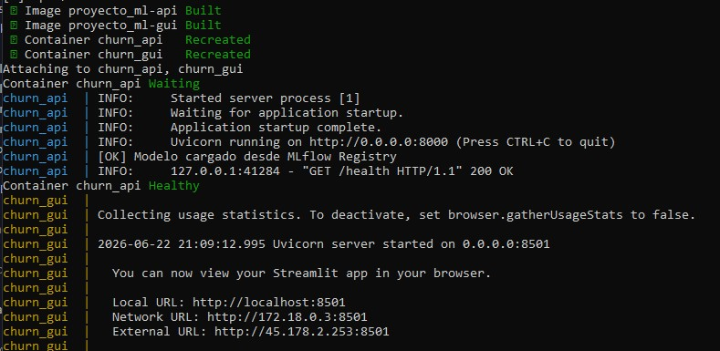
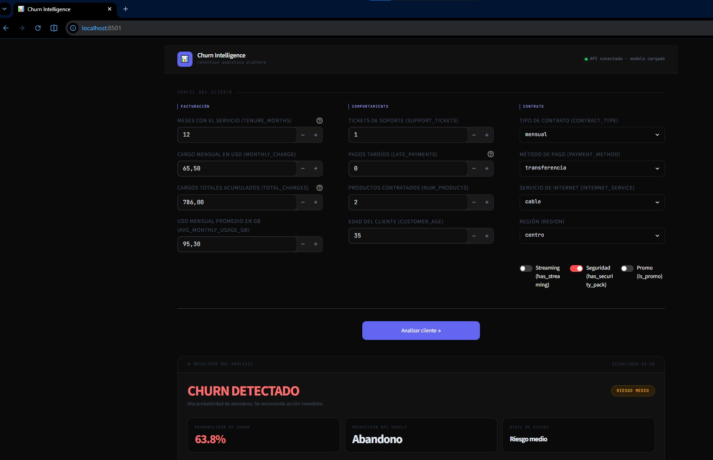
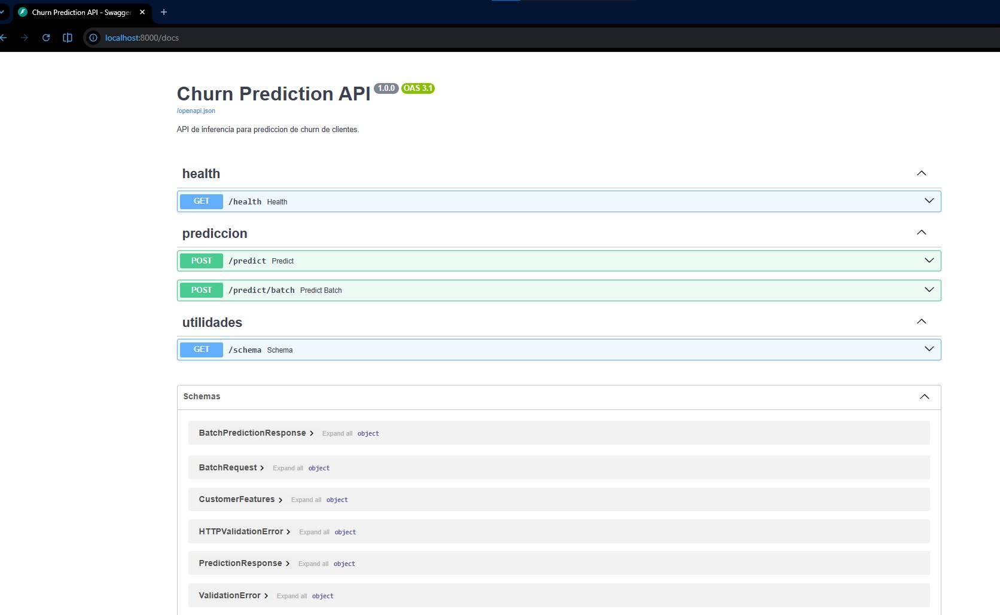
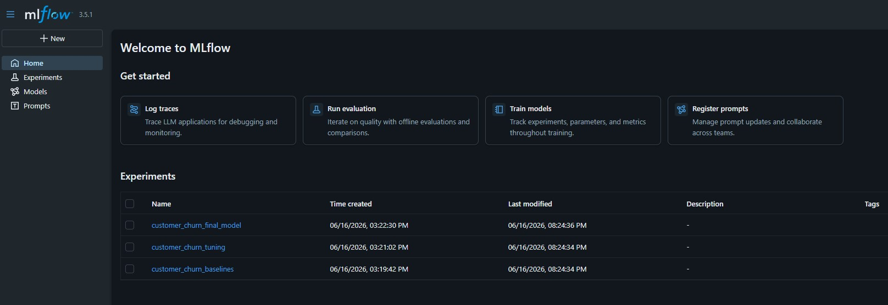
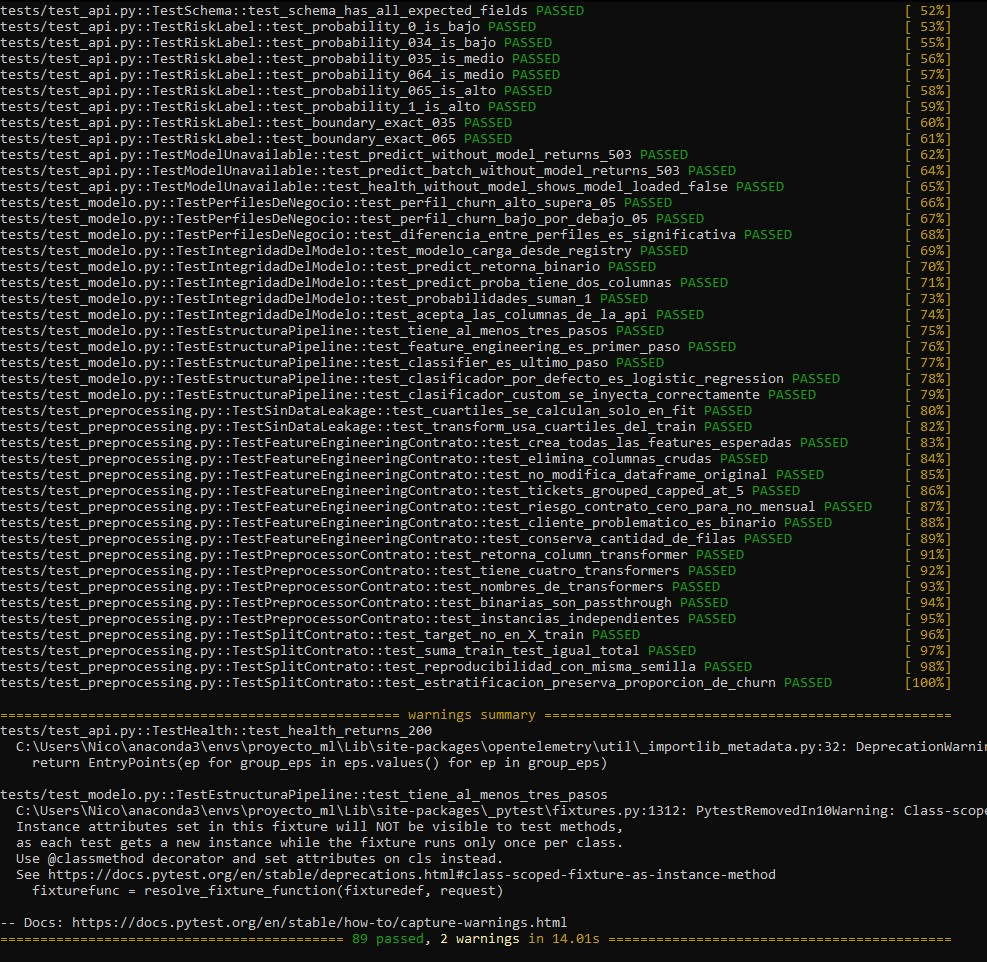

# proyecto_ml

Predicción de abandono de clientes (*Customer Churn*) para **AndesLink Servicios Digitales S.A.**

Proyecto académico de MLOps desarrollado para la materia **Laboratorio de Minería de Datos (ISTEA)**.

La solución implementa un flujo completo de Machine Learning que incluye:

* Preparación e ingeniería de datos.
* Entrenamiento y evaluación de modelos.
* Tracking de experimentos con MLflow.
* Versionado de datos y modelos con DVC.
* API de inferencia con FastAPI.
* Interfaz gráfica con Streamlit.
* Contenedorización con Docker.
* Orquestación con Docker Compose.
* Pruebas automatizadas con Pytest.

---

# Objetivo de negocio

AndesLink Servicios Digitales S.A. busca anticipar la cancelación voluntaria de clientes para activar campañas de retención y reducir la pérdida de ingresos recurrentes.

El problema se modela como una tarea de clasificación binaria:

* `0` → Cliente permanece.
* `1` → Cliente abandona el servicio (*churn*).

---

# Arquitectura de la solución

```text
Usuario
   │
   ▼
┌──────────────┐
│  Streamlit   │
└──────┬───────┘
       │ HTTP
       ▼
┌──────────────┐
│   FastAPI    │
└──────┬───────┘
       │
       ▼
┌──────────────┐
│ Modelo ML    │
│ Joblib       │
└──────────────┘

MLflow → Tracking de experimentos

DVC → Versionado de datos y modelos
```

---

# Estructura del proyecto

```text
proyecto_ml/
│
├── data/
│   ├── raw/
│   └── processed/
│
├── models/
│   ├── model_pipeline.joblib
│   ├── metrics.json
│   └── confusion_matrix.png
│
├── notebooks/
│   └── notebook.ipynb
│
├── reports/
│   └── INFORME_TECNICO.md
│
├── src/
│   ├── preprocessing.py
│   ├── feature_engineering.py
│   ├── train.py
│   ├── main.py
│   │
│   ├── api/
│   │   ├── api.py
│   │   └── schemas.py
│   │
│   └── gui/
│       └── app.py
│
├── tracking/
│   └── experiments.py
│
├── tests/
│   ├── test_api.py
│   ├── test_modelo.py
│   └── test_preprocessing.py
│
├── Dockerfile
├── Dockerfile.streamlit
├── docker-compose.yml
├── environment.yml
├── requirements-api.txt
├── requirements-streamlit.txt
└── README.md
```

---

# Tecnologías utilizadas

| Herramienta | Uso |
|-------------|-----|
| Python | Desarrollo principal |
| Pandas | Procesamiento de datos |
| Scikit-Learn | Entrenamiento y evaluación |
| Logistic Regression | Experimentación |
| RandomForest | Experimentación |
| XGBoost | Experimentación |
| MLflow | Tracking de experimentos |
| DVC | Versionado de datos y modelos |
| FastAPI | API de inferencia |
| Streamlit | Interfaz gráfica |
| Docker | Contenedorización |
| Docker Compose | Orquestación |
| Pytest | Testing |

---

# Instalación

## 1. Clonar el repositorio

```bash
git clone https://dagshub.com/carreronicoo/proyecto_ml.git <nombre_directorio>
cd <nombre_directorio>
git pull origin main
```

## 2. Crear entorno

```bash
conda env create -f environment.yml
conda activate proyecto_ml
```

## 3. Configurar acceso a DVC

```bash
dvc remote modify origin --local auth basic

dvc remote modify origin --local user TU_USUARIO_DAGSHUB

dvc remote modify origin --local password TU_TOKEN_DAGSHUB
```

## 4. Descargar datos y artefactos

```bash
dvc pull
```

Se descargarán automáticamente:

```text
data/raw/churn_sintetico.csv
data/processed/data_final.csv
models/model_pipeline.joblib
```

---

# Despliegue con Docker Compose

La forma recomendada de ejecutar la solución es mediante Docker Compose.

## Levantar todos los servicios

```bash
docker compose up --build
```

## Detener servicios

```bash
docker compose down
```

## Servicios disponibles

| Servicio    | URL                        |
| ----------- | -------------------------- |
| API FastAPI | http://localhost:8000      |
| Swagger UI  | http://localhost:8000/docs |
| Streamlit   | http://localhost:8501      |

---

# Ejecución local (opcional)

Para desarrollo o debugging.

## API

```bash
uvicorn src.api.api:app --reload
```

Disponible en:

```text
http://localhost:8000
```

Documentación:

```text
http://localhost:8000/docs
```

## Streamlit

```bash
streamlit run src/gui/app.py
```

Disponible en:

```text
http://localhost:8501
```

---

# API de inferencia

## Endpoint principal

### POST /predict

Ejemplo de respuesta:

```json
{
  "prediction": 1,
  "probability": 0.82
}
```

---

# Tracking de experimentos con MLflow

Para visualizar los experimentos:

```bash
mlflow ui
```

Acceder desde:

```text
http://localhost:5000
```

MLflow registra:

* Parámetros de entrenamiento.
* Métricas.
* Artefactos.
* Comparación de modelos.

---

# Testing

Ejecutar todas las pruebas:

```bash
pytest -v
```

Cobertura actual:

* API.
* Modelo.
* Preprocesamiento.

---

# Entrenamiento

Para ejecutar nuevamente el pipeline completo:

```bash
python src/main.py
```

El flujo realiza:

1. Preprocesamiento.
2. Feature Engineering.
3. Entrenamiento.
4. Evaluación.
5. Serialización del modelo.
6. Generación de métricas.

---

# Modelo seleccionado

Durante la etapa de experimentación se evaluaron:

* Logistic Regression
* Random Forest
* XGBoost

El modelo final seleccionado fue:

**Logistic Regression Tuned**

La elección se basó en su equilibrio entre capacidad predictiva, interpretabilidad y simplicidad operativa.

---

# Resultados

| Métrica   | Valor  |
| --------- | ------ |
| Precision | 0.60   |
| Recall    | 0.69   |
| ROC-AUC   | 0.7982 |

Las métricas completas se encuentran en:

```text
models/metrics.json
```

La matriz de confusión final se encuentra en:

```text
models/confusion_matrix.png
```

---

# Artefactos generados

```text
models/
├── model_pipeline.joblib
├── metrics.json
└── confusion_matrix.png
```

---

# Informe técnico

La documentación técnica completa puede consultarse en:

```text
reports/INFORME_TECNICO.md
```

Incluye:

* Análisis exploratorio.
* Ingeniería de características.
* Comparación de modelos.
* Ajuste de hiperparámetros.
* Resultados.
* Limitaciones y conclusiones.

---

# Notebook de exploración

```text
notebooks/notebook.ipynb
```

---

# Próximos pasos

Para la entrega final se incorporará:

* Prometheus.
* Grafana.
* Evidently AI.
* Monitoreo de drift.
* Observabilidad del modelo.
* Dashboards operativos.

---

# Evidencias de Funcionamiento

## Docker Compose



## Interfaz Gráfica (Streamlit)



## API FastAPI



## MLflow



## Testing Automatizado


```
```
